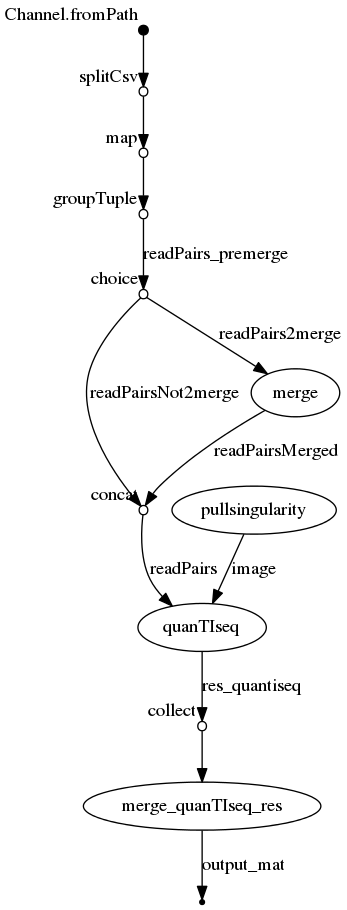

# quantiseq-nf

## Nextflow pipeline to run software quanTIseq in parallel to quantify immune cell content from RNA-seq data
[](https://circleci.com/gh/IARCbioinfo/quantiseq-nf/tree/master)
[](https://singularity-hub.org/collections/3065)


## Description
This Nextflow pipeline uses the singularity image of quanTIseq to launch the quanTIseq pipeline that performs immune cell quantification of 10 cell types from RNA-seq data. See https://icbi.i-med.ac.at/software/quantiseq/doc/ for general information about quanTIseq and the companion article Finotello, et al. Molecular and pharmacological modulators of the tumor immune contexture revealed by deconvolution of RNA-seq data. Genome Med. 2019;11:34. https://doi.org/10.1186/s13073-019-0638-6

## Dependencies
1. Nextflow : for common installation procedures see the [IARC-nf](https://github.com/IARCbioinfo/IARC-nf) repository.
2. [*singularity*](https://singularity.lbl.gov/all-releases)


## Input 
 | Type      | Description     |
  |-----------|---------------|
  | --input_folder    | a folder with RNA-seq fastq files |

## Parameters

* #### Optional

| Name | Default value | Description |
|-----------|--------------|-------------| 
|--output_folder   | . | Output folder for results|
|--cpu          | 1 | number of CPUs |
|--mem         | 2 | memory|
|--fastq_ext    | fq.gz | extension of fastq files|
|--suffix1      | \_1 | suffix for second element of read files pair|
|--suffix2      | \_2 | suffix for second element of read files pair|
|--image      | null | singularity image|

Note that if no singularity image is provided, the image is pulled from singularity hub. If the pipeline is reused frequently, it might be more efficient to pull the image manually with the command:
```bash
singularity pull quantiseq2.img IARCbioinfo/quantiseq-nf:v1.1
```
and then to provide the path to quantiseq2.img as a parameter.

## Usage
```bash
nextflow run iarcbioinfo/quantiseq-nf -r v1.1 --input_folder input --output_folder output --image quantiseq2.img
```

## Output 
  | Type      | Description     |
  |-----------|---------------|
  | quanTIseq_cell_fractions_matrix.txt    |  a matrix with cell fractions (columns) for each sample (row) |
  |  quanTIseq_gene_tpm_matrix.txt   |  a matrix with gene counts (rows) for each sample (column)|
  | intermediate_results/quantiseqResults_sample    |  a folder with quanTIseq results |

For each sample, a folder is created in folder intermediate_results with the two quanTIseq output files (see https://icbi.i-med.ac.at/software/quantiseq/doc/ for details): 
- quanTIseq_gene_tpm_sample.txt, the expression quantification table (in Transcripts Per Million or TPM) with a row for each of the 19424 annotated genes
- quanTIseq_cell_fractions_sample.txt, the table with the proportion of cells from each cell type (columns)

## Directed Acyclic Graph

### With default options
[](http://htmlpreview.github.io/?https://github.com/IARCbioinfo/quantiseq-nf/blob/master/dag.html)

## Contributions

  | Name      | Email | Description     |
  |-----------|---------------|-----------------| 
  | Tiffany Delhomme   |     Delhommet@student.iarc.fr | Developer |
  | Nicolas Alcala*    | AlcalaN@iarc.fr    | Developer to contact for support |
